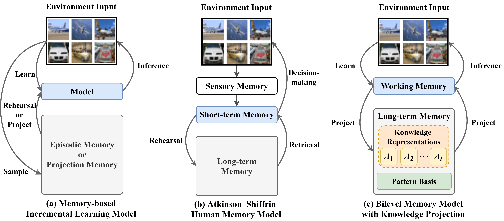
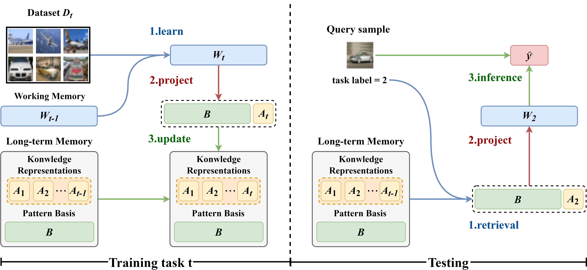
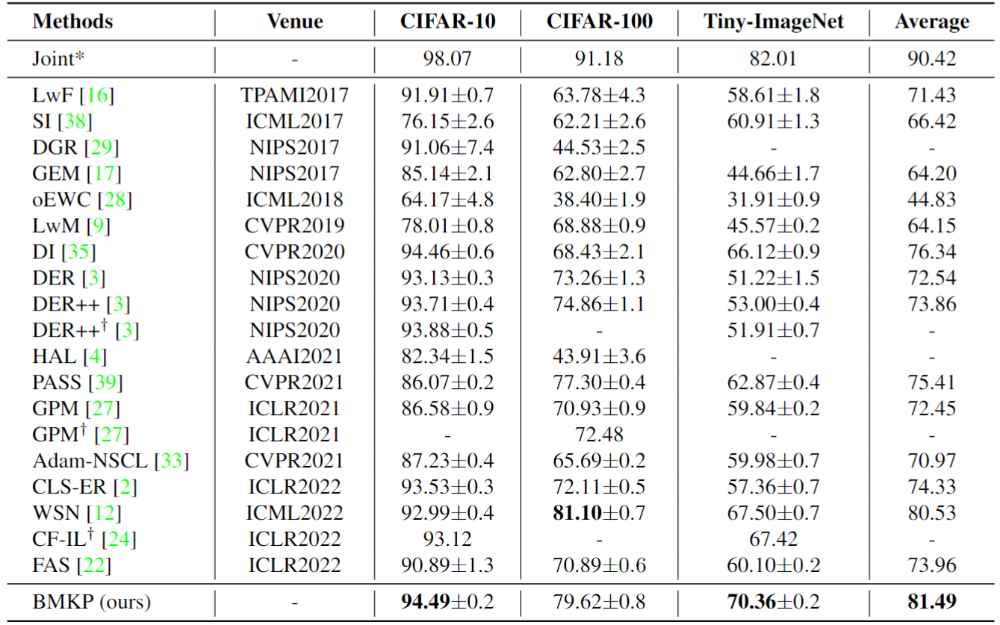

# BMKP 

Official repository of CVPR 2023 paper: "Decoupling Learning and Remembering: a Bilevel Memory Framework with Knowledge Projection for Task-Incremental Learning"

## Paper

>   **Decoupling Learning and Remembering: a Bilevel Memory Framework with Knowledge Projection for Task-Incremental Learning**
>
>   CVPR2023

## Abstract

The dilemma between plasticity and stability arises as a common challenge for incremental learning. 
In contrast, the human memory system is able to remedy this dilemma owing to its multi-level memory structure, which motivates us to propose a **B**ilevel **M**emory system with **K**nowledge **P**rojection (BMKP) for incremental learning. BMKP decouples the functions of learning and remembering via a bilevel-memory design: a working memory responsible for adaptively model learning, to ensure plasticity; a long-term memory in charge of enduringly storing the knowledge incorporated within the learned model, to guarantee stability. However, an emerging issue is how to extract the learned knowledge from the working memory and assimilate it into the long-term memory. To approach this issue, we reveal that the model learned by the working memory are actually residing in a redundant high-dimensional space, and the knowledge incorporated in the model can have a quite compact representation under a group of pattern basis shared by all incremental learning tasks. Therefore, we propose a knowledge projection process to adapatively maintain the shared basis, with which the loosely organized model knowledge of working memory is projected into the compact representation to be remembered in the long-term memory. We evaluate BMKP on CIFAR-10, CIFAR-100, and Tiny-ImageNet. The experimental results show that BMKP achieves state-of-the-art performance with lower memory usage.

## Setup

-   Use `./utils/main.py` to run experiments.
-   Some training result can be found in folder `./result`.

## Datasets

**Task-IL settings**

-   Sequential CIFAR-10
-   Sequential CIFAR-100
-   Sequential Tiny ImageNet

## Performance

## Requirement

+ numpy==1.16.4
+ Pillow==6.1.0
+ torch==1.3.1
+ torchvision==0.4.2

## Related repository

https://github.com/aimagelab/mammoth